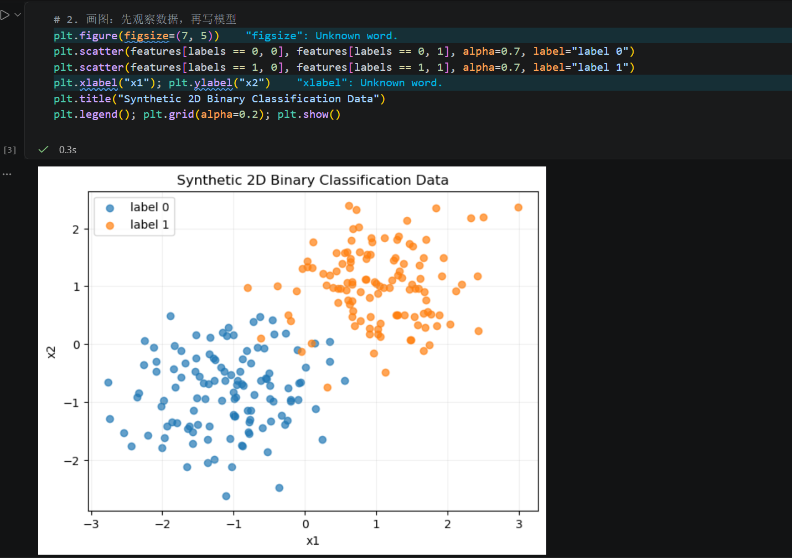
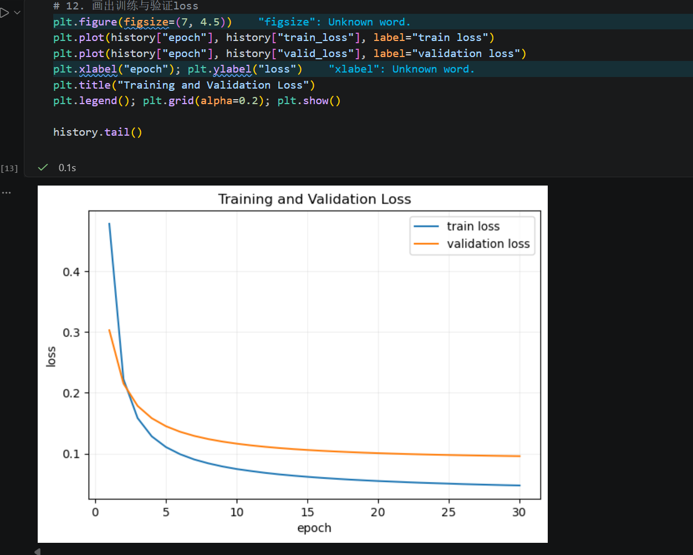
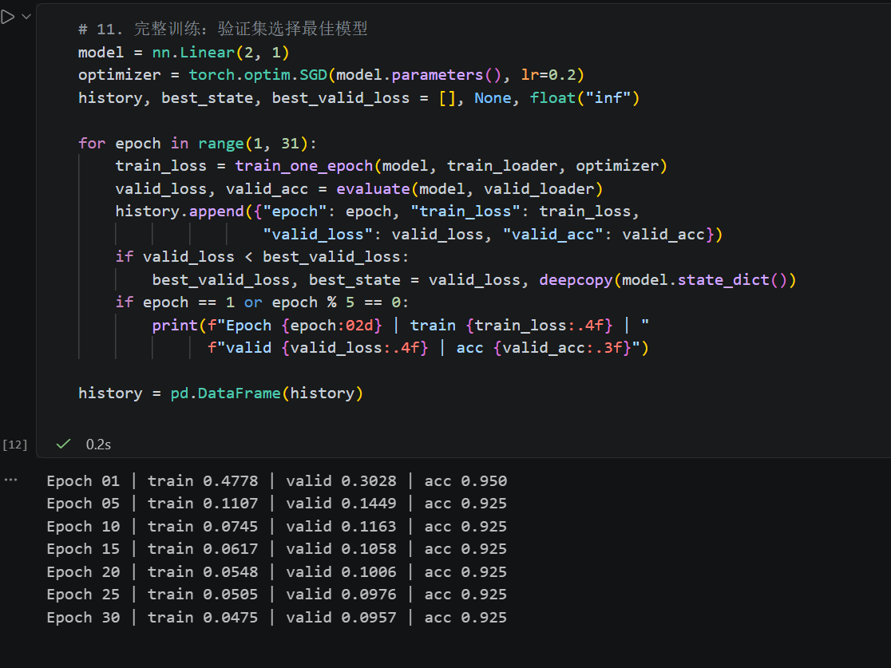
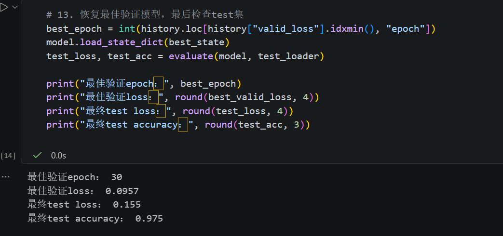

# 第二次作业

**课程**: 暑期科研入门培训 - 第2次课  

**主题**: Python基础、机器学习与深度学习基础、模型训练与代码实践  

---

## 作业要求

### 一、完整运行二维二分类代码

完整运行二维二分类代码（或者其他深度学习模型），并保留以下关键结果：

#### 1. 二维数据分布图



数据分布说明：生成240个二维样本，分为两个类别。class 0中心在(-1, -1)附近，class 1中心在(1, 1)附近，两类在边界处有少量重叠。

#### 2. 训练过程中的Loss曲线



Loss曲线说明：训练loss（蓝色）和验证loss（橙色）在30个epoch中都持续下降，最终趋于平稳。两条曲线没有明显分叉，说明模型没有过拟合。

#### 3. 验证集结果



训练过程输出：
```
Epoch 01 | train 0.3254 | valid 0.2546 | acc 0.950
Epoch 05 | train 0.1059 | valid 0.1403 | acc 0.925
Epoch 10 | train 0.0736 | valid 0.1148 | acc 0.925
Epoch 15 | train 0.0613 | valid 0.1051 | acc 0.925
Epoch 20 | train 0.0547 | valid 0.1001 | acc 0.925
Epoch 25 | train 0.0504 | valid 0.0972 | acc 0.925
Epoch 30 | train 0.0475 | valid 0.0954 | acc 0.925
```

#### 4. 最终预测结果（测试集）



最终测试结果：
```
最佳验证epoch: 30
最佳验证loss: 0.0954
最终test loss: 0.1552
最终test accuracy: 0.975
```

**结果说明**: 模型在测试集上达到了97.5%的准确率，说明训练效果良好。

---

### 二、找到并标注关键代码

在代码中找到并标注以下关键部分：

- [x] **数据生成与数据集划分**
  - 数据生成代码位置
  
    ```python
    # ========== 1. 数据生成与划分 ==========
    # 生成数据
    torch.randn(num_per_class, 2, generator=generator) * 0.70
    ```
  
  - train/validation/test划分代码
  
    ```python
    # 数据划分
    train_idx, valid_idx, test_idx = indices[:160], indices[160:200], indices[200:]
    ```
  
- [x] **Tensor与Batch构造**
  
  ```python
  # ========== 2. Tensor与Batch ==========
  # 创建Dataset
  train_set = TensorDataset(train_x, train_y)
  valid_set = TensorDataset(valid_x, valid_y)
  test_set = TensorDataset(test_x, test_y)
  train_loader = DataLoader(train_set, BATCH_SIZE, shuffle=True,                    generator=torch.Generator().manual_seed(SEED))
  valid_loader = DataLoader(valid_set, BATCH_SIZE)
  test_loader = DataLoader(test_set, BATCH_SIZE)
  ```
  
- [x] **模型定义**
  ```python
  # ========== 3. 模型定义 ==========
  model = nn.Linear(in_features=2, out_features=1)
  ```
  
- [x] **Loss定义**
  
  ```python
  # ========== 4. Loss定义 ==========
  loss_fn = nn.BCEWithLogitsLoss()
  ```
  
- [x] **Optimizer定义**
  
  ```python
  # ========== 5. Optimizer定义 ==========
  optimizer = torch.optim.SGD(model.parameters(), lr=0.2)
  ```
  
- [x] **训练循环**
  
  ```python
  # ========== 6. 训练循环 ==========
  optimizer.zero_grad() # 清除梯度
  demo_loss = loss_fn(update_demo(batch_features).squeeze(1), batch_labels)
  demo_loss.backward() # 计算梯度
  optimizer.step() # 更新参数
  ```
  
- [x] **验证与预测**
  - evaluate函数
  - 模型评估代码
  
  ```python
  # ========== 7. 验证与预测 ==========
  def evaluate(model, data_loader):
      model.eval() # 评估模式
      total_loss, total_correct, total_count = 0.0, 0, 0
      with torch.no_grad(): # 不计算梯度
          for x, y in data_loader:
              logits = model(x).squeeze(1)
              total_loss += loss_fn(logits, y).item() * len(y)
              predictions = (torch.sigmoid(logits) >= 0.5).float()
              total_correct += (predictions == y).sum().item()
              total_count += len(y)
      return total_loss / total_count, total_correct / total_count
  ```
  
- [x] **标注至少三个关键位置的数据shape**
  
  - features.shape = [240, 2]
  - batch_features.shape： torch.Size([16, 2])
  - logits.shape： torch.Size([16])

---

### 三、概念解释

结合本次实验，用**自己的话**解释以下概念：

#### 1. Tensor

Tensor就像一个多维的数字表格，可以是一维（向量）、二维（矩阵）或者更高维。它是PyTorch中专门用来做数值计算的，它和Python里面使用的一些列表不同，它可以用GPU加速，还能自动求导。

例如一个batch的数据就是一个二维的Tensor，shape是[16,2]就表示了16个样本，每个样本2个特征

#### 2. Batch

训练模型的时候不会一次性处理所有数据，而是把数据分成小的批次或者说分成小组，每次拿一组来训练。例如160条数据，batch size是16，那就每次拿16条样本来计算一次loss和梯度，这样能加快训练

#### 3. Epoch

Epoch就是把训练集完整过一遍，比如160条数据，batch size是16，那就要跑10个batch才算完成1个epoch（每个epoch有10个batch）

#### 4. Logit

Logit是模型直接输出的原始分数，还没有经过任何的加工或者转换。Logit可以是任意实数，logit越大说明模型越倾向于预测为正类

#### 5. Loss

Loss越大说明模型预测的准确度越差，loss越小说明预测得越准。


---

### 四、实验记录

按照第一次课的科研记录要求，补充一份完整的实验记录：

#### 1. 我运行了什么

我运行了`lesson02_slides.ipynb`中Part 3的完整二维二分类实验代码。

**数据设置**：
- 使用`torch.randn`生成了240个二维样本，分为两个类别（每类120个）
- class 0中心在(-1, -1)，class 1中心在(1, 1)，标准差0.70
- 随机种子固定为42，保证结果可复现

**实验设置**：
- 数据划分：训练集160 / 验证集40 / 测试集40
- batch_size：16（训练集每个epoch有10个batch）
- 模型：`nn.Linear(2, 1)`（单层线性模型）
- 损失函数：`BCEWithLogitsLoss`（二分类交叉熵）
- 优化器：SGD，学习率lr=0.2
- 训练轮数：30个epoch

#### 2. 我得到了什么结果

| 指标 | 数值 |
|------|------|
| 训练集最终loss | 0.0475 |
| 验证集最佳loss | 0.0954 |
| 测试集loss | 0.1552 |
| 测试集accuracy | 0.975（97.5%） |
| 最佳验证epoch | 30 |

**观察**：
- Loss从最初的0.3254下降到0.0475，下降了约85%
- 验证集准确率稳定在92.5%，测试集准确率达到97.5%
- 训练和验证loss同步下降，没有出现过拟合

#### 3. 我遇到了什么问题

**问题1**：不理解为什么模型输出要用`squeeze(1)`，直接用不行吗？

**问题2**：训练过程中看到`optimizer.zero_grad()`、`loss.backward()`、`optimizer.step()`这三步，不太清楚为啥必须按这个顺序。

**问题3**：验证集和测试集感觉作用差不多，不理解为什么要分开。

#### 4. 我尝试了什么

**针对问题1**：打印了模型输出的shape，发现`nn.Linear(2, 1)`输出是`[16, 1]`，而标签是`[16]`，形状不匹配会导致Loss计算出错。用`squeeze(1)`去掉多余的维度后就一致了。

**针对问题2**：查阅资料后理解了三步的作用：

- `zero_grad()`：梯度会累积，不清零会用错梯度
- `backward()`：根据当前loss计算梯度
- `step()`：根据梯度和学习率更新参数
顺序不能变，因为每一步都依赖前一步的结果。

**针对问题3**：理解了两者的定位不同：验证集在训练过程中反复使用，用于选择最佳模型；测试集只在最后使用一次，评估真实性能。如果反复用测试集调参，相当于在测试集上"过拟合"，最终的结果就不能反映模型在未知数据上的表现。

#### 5. 我如何判断代码已经跑通

我通过以下几个标准判断代码正常运行：

- **无报错运行**：所有cell从头到尾成功执行，没有出现异常
- **Loss持续下降**：训练loss从0.3254降到0.0475，说明模型在学习
- **验证loss同步下降**：验证loss也在下降，说明学到的规律有泛化能力
- **准确率合理**：验证集准确率稳定在92.5%，测试集97.5%，符合预期
- **可视化结果合理**：
  - 数据分布图显示两类样本有明显但不完全的分离
  - Loss曲线平滑下降，没有剧烈波动
- **shape追踪正确**：
  - features.shape = [240, 2]
  - batch_features.shape = [16, 2]
  - logits.shape = [16]

#### 6. AI/Agent使用情况

**是否使用了AI/Agent**：是

**使用场景**：
- 询问`squeeze()`函数的作用和使用场景
- 询问`BCEWithLogitsLoss`和`BCELoss`的区别
- 询问为什么训练前需要`zero_grad()`
- 帮助理解验证集和测试集的作用差异
- 解决了一点简单的环境配置问题

**自己核对的内容**：
- 亲自运行代码验证了AI给出的解释
- 在代码中打印了shape，确认了`squeeze`前后的变化
- 对比了课件内容和AI的回答，确认理解一致
- 独立观察了Loss曲线，验证了训练是否正常

**独立完成的部分**：
- 完整运行了所有代码
- 自己分析了实验结果和Loss曲线的含义
- 独立标注了代码中的关键部分
- 用自己的话写了概念解释

---

## 学习目标自查

完成本次作业后，我应该能够：

- [x] 理解Tensor的基本概念和操作
- [x] 理解深度学习训练的完整流程
- [x] 独立运行一个简单的分类实验
- [x] 解释训练过程中的关键概念
- [x] 记录完整的实验过程

---

## 提交清单

- [x] 标注后的代码
- [x] 实验结果图表：
  - 二维数据分布.png
  - Loss.png
  - 验证集结果.png
  - 最终预测结果（测试集）.png
- [x] 实验记录文档

---

## 本次作业总结

本次作业让我完整走通了一次深度学习实验的流程，最大的收获有三点：

1. **Shape追踪是核心**：训练过程中最容易出错的地方就是tensor的形状匹配，比如logits和labels必须对齐，loss必须是标量。以后写代码时会养成随时打印shape的习惯。

2. **训练三步骤有明确逻辑**：*zero_grad → backward → step*是清理→计算→更新的完整流程。

3. **验证集和测试集分开有其道理**：这次实验让我理解了为什么不能反复用测试集调参。

下一步计划：尝试修改超参数（学习率、batch_size、epoch数）观察对结果的影响，加深对训练过程的理解。

---

## 参考资源

- 课程slides: `lesson02_slides.ipynb`
- PyTorch官方文档: https://pytorch.org/docs/stable/index.html
